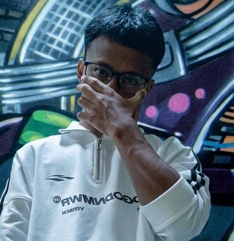

# 🌐 VoyagerXyroo | Frontend Developer

## 👨‍💻 Profil Pengembang

**Frontend Developer | UI/UX Enthusiast | React & Modern Web Teknologi**

Seorang pengembang frontend yang berdedikasi dalam menciptakan antarmuka web yang indah, responsif, dan memukau. Memiliki passion untuk menciptakan pengalaman pengguna yang luar biasa melalui kode yang bersih dan desain yang cerdas.

### 🎨 Keahlian Utama
- Responsive Web Design
- Single Page Applications (SPA)
- Performance Optimization
- State Management
- Frontend Frameworks & Libraries

## 🚀 Tech Stack

### Bahasa & Teknologi

### Styling & UI

### Tools & Ecosystem

## 🏆 Proyek Unggulan

### 1. WebFlow Dashboard
**Kompleks Dashboard Manajemen**
- 🖥️ Antarmuka responsif dengan React
- 📊 Visualisasi data interaktif
- 🔒 Manajemen state dengan Redux
- 🎨 Desain modern menggunakan Tailwind CSS

### 2. E-Commerce Platform
**Toko Online Canggih**
- 🛒 Single Page Application
- 💳 Integrasi pembayaran terintegrasi
- 🚀 Optimasi performa tingkat lanjut
- 🔍 SEO-friendly dengan Next.js

### 3. Portfolio Tracker
**Aplikasi Pelacak Investasi**
- 📈 Real-time data visualization
- 🌐 Dukungan multi-platform
- 🔐 Autentikasi & keamanan data
- 📱 Desain responsif mobile-first

## 📊 GitHub Statistics

## 🔍 Fokus Pengembangan

- Modern Web Frameworks
- Performance Optimization
- Accessibility
- Design Systems
- Micro-frontend Architecture

## 💡 Blog & Artikel Teknis

- "Strategi Optimasi Performa React"
- "State Management Modern dengan Redux Toolkit"
- "Desain Responsif: Pendekatan Mobile-First"

## 🌍 Komunitas & Kontribusi

- 🏅 **Open Source Contributor**
- 💬 **Frontend Meetup Speaker**
- 📝 **Technical Blogger**

## 📫 Kontak Profesional

)

## 💬 Filosofi Pengembangan

> "Setiap baris kode adalah kesempatan untuk menciptakan pengalaman yang memukau." - VoyagerXyroo

---

  🚀 Dua Tiga Jarjit Makan Kanjut, Lanjutt 🌐

